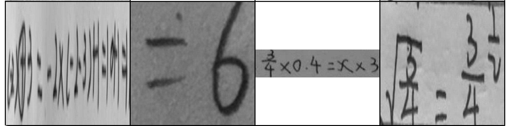
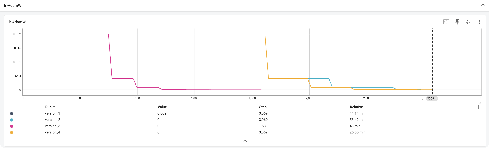
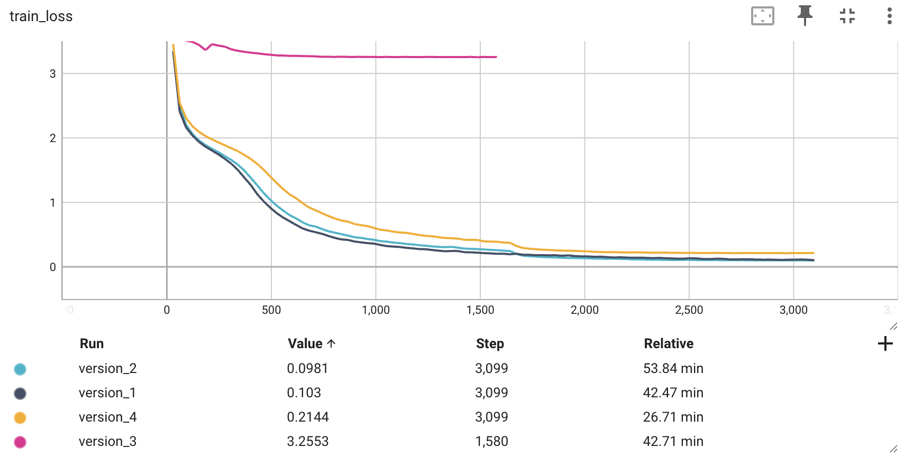
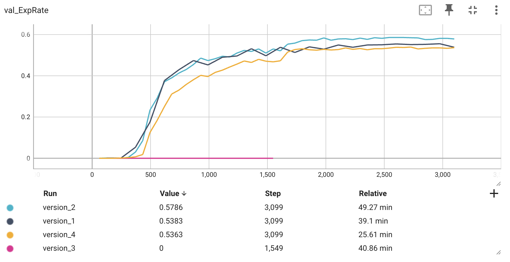
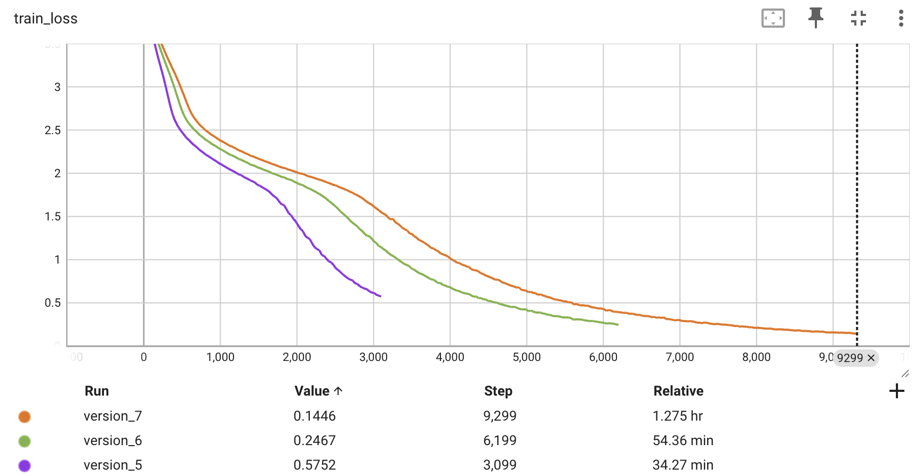
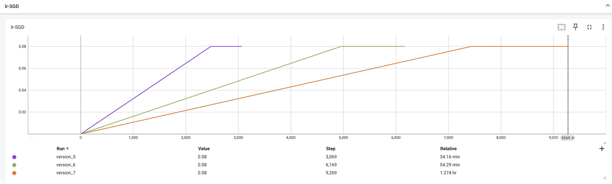
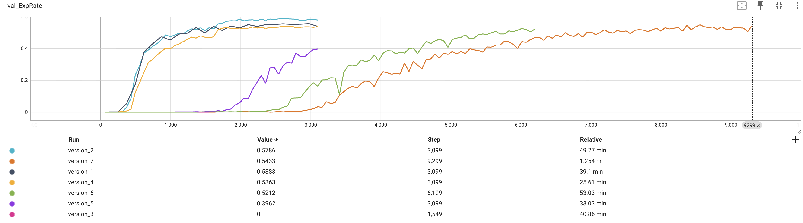
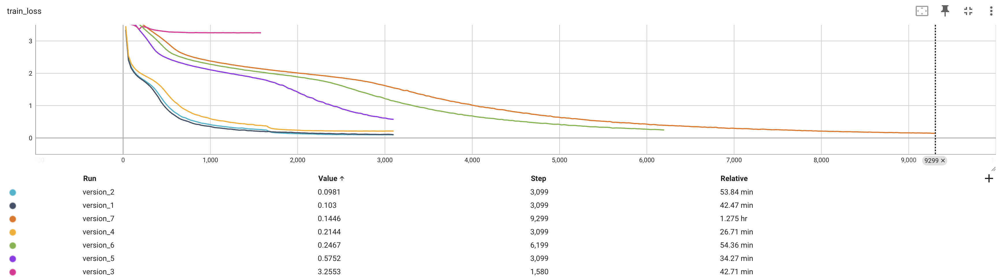

# 项目说明

## DataSet

### 数据集说明
- 数据集总量：`9911份`
- 1、组员手工切分 + 标注 `1000份`;
- 2、使用公共数据集`8911份`;

## 实验说明 —— 训练设备为 1 张 英伟达A10 GPU ，进行 7 轮实验

### 实验内容
#### 前 4 轮使用 AdamW 优化器进行训练
- version_1 : 以 学习率`2e-3`，不开启`数据增强`,未启用`动态学习率`,进行`Epoch:100`训练 → baseline;
```
实验结果 :
val_ExpRate : 53.83%
Correct (ExpRate): 51.87%
Correct <= 1 error: 69.32%
Correct <= 2 errors: 78.30%
Correct <= 3 errors: 82.54%
```

### 未开启数据增强数据集


- version_2: 开启`数据增强`,启用`动态学习率` → 识别准确率显著提升;
```
实验结果 :
val_ExpRate : 57.86%
Correct (ExpRate): 53.48%
Correct <= 1 error: 70.33%
Correct <= 2 errors: 79.21%
Correct <= 3 errors: 82.74%
```

### 开启数据增强数据集


- version_3: 增加 decoder 层数以提升模型容量 → [ num_decoder_layers : 3 → 4 ]
```
实验结果 : 模型层次太深，无法学习
```

- version_4: 提升 drouput 0.3 → 0.5 → 【 正则化过高，会降低 ExpRate，适当减小 dropout 】
```
实验结果 : 
val_ExpRate : 53.63%
Correct (ExpRate): 51.16%
Correct <= 1 error: 68.52%
Correct <= 2 errors: 77.40%
Correct <= 3 errors: 81.74%
```

### AdamW 优化器学习率变化曲线


### AdamW_train_loss


### AdamW_val_ExpRate


#### 后 3 轮使用 SGD 优化器，进行对比实验
- version_5 : 更换优化器 → `SGD` , 学习率调整为 0.08(论文使用学习率);

```
此处观察到，在完成 `Epoch:100` 训练之后，train_loss并未收敛，因此 `Epoch:100 → 200`
```
### SGD_train_loss


- version_6:以 学习率`2e-3`，开启`数据增强`,进行`Epoch:200`训练;
```
val_Exprate : 52.12%
Correct (ExpRate): 47.43%
Correct <= 1 error: 66.90%
Correct <= 2 errors: 76.19%
Correct <= 3 errors: 80.02%
```

- version_7:以 学习率`2e-3`，开启`数据增强`,进行`Epoch:300`训练;
```
val_Exprate : 54.33%
Correct (ExpRate): 50.45%
Correct <= 1 error: 68.62%
Correct <= 2 errors: 77.60%
Correct <= 3 errors: 82.14%
```



## 最终实验结果




